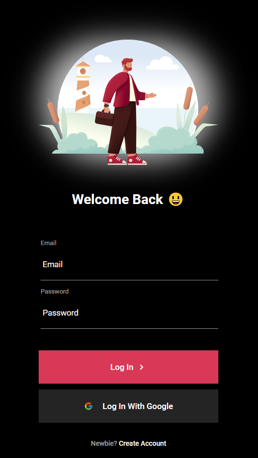
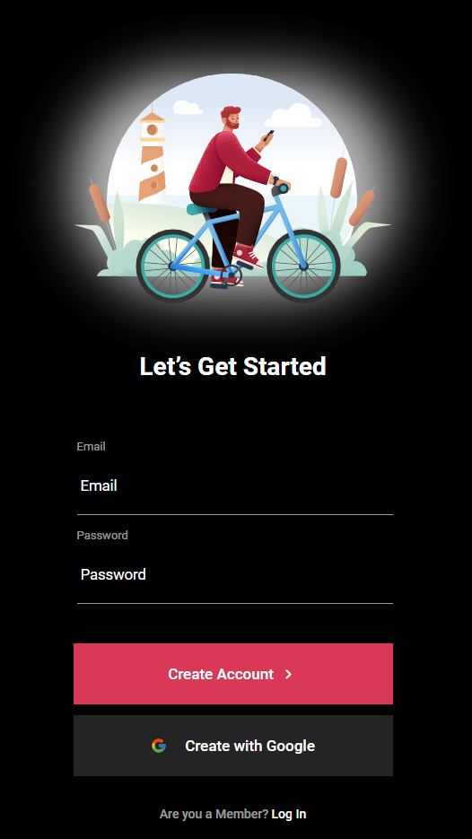

# Tela de Login com HTML e CSS

Este repositório contém um projeto simples de tela de login desenvolvido com HTML e CSS. O projeto inclui uma interface de login básica com campos de entrada para email e senha, além de opções para login com Google e navegação entre telas de login e cadastro.

## Funcionalidades

- **Tela de Login**:
  - Campos de entrada para email e senha.
  - Botões para login de usuário e login com Google.
  - Link para navegação para a tela de cadastro.

- **Tela de Cadastro**:
  - Interface que permite ao usuário criar uma conta, com uma navegação simples de volta para a tela de login.

<h2 align="center">Imagens</h2>

  
  

